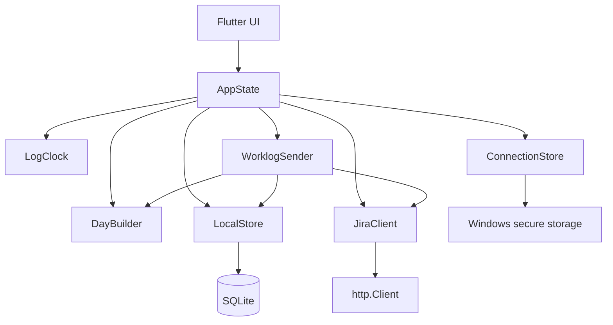

# Архитектура Jira Time Tracker

## Статус и назначение

Архитектура MVP. Все модули полностью реализованы в соответствии со спецификацией: Flutter Desktop каркас, межпроцессная блокировка Windows (`SingleInstanceLock`), `LocalStore` с SQLite-схемой v3, Windows Credential Manager FFI, авторизация Direct/Scoped в `JiraClient`, чистый `LogClock`, каталог задач `IssueParser`, чистый движок расписания `DayBuilder`, экраны интерфейса `WorkScreen`, `DayScreen`, диалоги добавления и редактирования, загрузка существующих worklogs Jira и модуль надежной отправки/сверки `WorklogSender`.

Документ определяет, где живут логика и данные и как их проверять. Пользовательские правила, параметры сборки, Jira-протокол и критерии готовности находятся в [спецификации MVP](docs/specs/jira-time-tracker-mvp.md). Правила работы исполнителя — в [AGENTS.md](AGENTS.md).

Перед реализацией UI прочитай [описание экранов и интерактивный макет](docs/design/UX.md). HTML-макет служит ориентиром для Flutter-виджетов и не является модулем приложения.

## 1. Форма приложения

Один Flutter Desktop-процесс для Windows, прямое подключение к Jira Cloud, локальная SQLite-база и защищённое хранилище credentials. Таймеры восстанавливаются из сохранённого времени старта; фоновый процесс для отсчёта не нужен.

Стек: Flutter stable и Dart, Material 3, встроенные ChangeNotifier/ListenableBuilder. Зависимости: http для HTTP и подстановки клиента в тестах, sqlite3 для базы, path_provider для каталога данных, flutter_secure_storage для credentials, uuid для постоянных идентификаторов. Выбирай совместимые с SDK версии; после создания проекта их источником истины служат pubspec.yaml и pubspec.lock.

Windows-поддержка и требования: [sqlite3](https://pub.dev/packages/sqlite3), [path_provider](https://pub.dev/packages/path_provider), [flutter_secure_storage](https://pub.dev/packages/flutter_secure_storage), [Flutter Windows toolchain](https://docs.flutter.dev/platform-integration/windows/setup). В частности, для выбранной версии secure storage проверь наличие C++ ATL.

Каждый модуль скрывает содержательную работу за небольшим интерфейсом. Для MVP достаточно конкретных классов и функций, передаваемых через конструкторы. ORM, DI-контейнер, сервер, шина событий и отдельный слой use cases не нужны.

## 2. Модули и направление зависимостей

Стрелка означает «вызывает». main.dart собирает зависимости и передаёт их AppState. Models используют все модули; сами модели не импортируют UI, SQLite, HTTP или плагины платформы.

| Путь | Статус | Модуль и его интерфейс | Что скрывает реализация |
|---|---|---|---|
| lib/main.dart | Реализован | Запуск и сборка зависимостей | Открытие хранилищ, блокировка второго пишущего экземпляра, восстановление состояния, запуск Flutter UI; Flutter Driver включается только явным `ENABLE_FLUTTER_DRIVER` для отладки |
| lib/single_instance_lock.dart | Реализован | SingleInstanceLock: эксклюзивная блокировка файла | Межпроцессная блокировка Windows (`RandomAccessFile.lockSync`) |
| lib/models.dart | Реализован | Модели, enum и результаты операций | Типизированное представление Issue, QuickIssue, исходного лога, черновика, интервала и ошибок; без сетевых JSON-форматов |
| lib/local_store.dart | Реализован | LocalStore: операции над локальными данными | SQL, миграции, scoped-каталог QuickIssue, транзакции, привязка и атомарное исключение логов из неотправленных черновиков, журнал отправки, общие настройки приложения и единственный пишущий экземпляр |
| lib/secure_storage.dart | Реализован | SecureStorage: защищенное хранилище | Нативное хранение через Windows Credential Manager FFI, `InMemorySecureStorage` для тестов |
| lib/connection_store.dart | Реализован | ConnectionStore: загрузка формы из saved/env и сохранение подключения | Подстановка окружения, защищённое хранение credentials и сохранение проверенного маршрута подключения |
| lib/issue_parser.dart | Реализован | IssueParser: разбор ввода ключа, numeric ID и URL browse задачи | Извлечение идентификатора, очистка URL, поддержка разных форматов ввода |
| lib/jira_client.dart | Реализован | JiraClient: проверить подключение, получить задачу/день, создать интервал, сверить запись | Авторизация (прямой и scoped маршруты), ADF, properties, обработка HTTP-ответов и ошибок |
| lib/log_clock.dart | Реализован | LogClock: чистый Dart расчёт длительности по состоянию лога и nowUtc | Вычисление прошедшего времени, переходы start/pause, обнаружение отрицательной разницы часов |
| lib/day_builder.dart | Реализован | DayBuilder: buildAsRecorded(input), build(input, seed) и validate(plan, existingWorklogs, {requirePauses}) | Прямой перенос как записано, алгоритмическое распределение времени (Smart Rebuild), размещение пауз, деление задач > 1ч и валидация |
| lib/worklog_sender.dart | Реализован | WorklogSender: sendDraft, reconcileUnknown, разрешение unknown по явному действию | Порядок записи журнала и POST, частичный успех, восстановление после обрыва, запрет слепого повтора |
| lib/app_state.dart | Реализован | AppState: координация состояния экрана и пользовательские действия | Последовательность вызовов модулей, активный scope, состояние занятости, тема и язык, сохраняемые DaySettings, таймеры и очередь логов |
| lib/app_message.dart | Реализован | AppMessage и MessageException: собственные сообщения приложения | Идентификатор, параметры и исходный диагностический текст без зависимости от Flutter; совместимое чтение старых ошибок и кодирование новых сохранённых ошибок |
| lib/agent_instructions.dart | Реализован | Стандартное правило, инструкция и справка для агента на RU/EN | Чистые текстовые шаблоны с явным языком и URL; контракт языка определён в MVP, разделе 8.2 |
| lib/l10n/ | Реализован | Каталоги ARB и сгенерированные AppLocalizations | Русские и английские подписи, параметры и формы количества; генерируются штатным `flutter gen-l10n` / `flutter pub get` |
| lib/ui/message_format.dart | Реализован | Представление AppMessage и длительностей | Выбор перевода по текущему BuildContext, рекурсивное представление причины; исходные данные Jira и пользователя не переводятся |
| lib/ui/date_localizations.dart | Реализован | Английская Material-локализация с датой день–месяц–год | Единый календарный ввод и формат числовой даты; пользовательские правила определены в MVP, разделе 8.2 |
| lib/ui/shell_screen.dart | Реализован | ShellScreen: общая оболочка, табы «Работа» и «День», настройки | Виджеты, баннер read-only, навигация |
| lib/ui/work_screen.dart | Реализован | WorkScreen: каталог задач, таймеры, очередь логов и история | Карточки задач, меню быстрых задач, живые таймеры, очередь неиспользованных логов, нижняя панель сборки |
| lib/ui/day_screen.dart | Реализован | DayScreen: календарный день, расписание, шкала, отправка и сверка | Таблица расписания, визуализация пауз и конфликтов, отправка в Jira, сверка unknown |
| lib/ui/add_time_dialog.dart | Реализован | AddTimeDialog: диалог ручного добавления времени (A01) | Быстрые задачи отдельной первой группой, ввод часов/минут, опциональное описание, фиксированное время старта, валидация |
| lib/ui/edit_log_dialog.dart | Реализован | EditLogDialog: редактирование свободного остановленного лога | Изменение часов, минут, описания работы и фиксированного времени старта |
| lib/ui/split_log_dialog.dart | Реализован | SplitLogDialog: разделение свободного лога на две части | Настройка смещения точки разделения, индивидуальные описания обеих частей |
| lib/ui/merge_logs_dialog.dart | Реализован | MergeLogsDialog: объединение нескольких свободных логов | Выбор целевой задачи и объединение накопленного времени и комментариев |
| lib/ui/edit_segment_dialog.dart | Реализован | EditSegmentDialog: редактирование отдельного интервала расписания | Изменение времени начала и длительности интервала |
| lib/ui/split_segment_dialog.dart | Реализован | SplitSegmentDialog: разделение интервала расписания дня | Разрезание сегмента на две последовательные части с сохранением позиции в дне |
| lib/ui/merge_segments_dialog.dart | Реализован | MergeSegmentsDialog: объединение частей одного источника | Слияние сегментов с суммированием длительности без потери обратной ссылки |
| lib/ui/gap_actions_dialog.dart | Реализован | GapActionsDialog: быстрые целевые действия над свободным промежутком расписания | Схлопывание зазора (snap), растягивание задачи (fill) и точная длительность с выталкиванием волной (ripple push) |
| lib/ui/settings_dialog.dart | Реализован | SettingsPage: настройки приложения | Закреплённая тема, адаптивная навигация Jira / день / быстрые задачи / API и одно активное содержимое |
| lib/ui/quick_issue_dialog.dart | Реализован | QuickIssueDialog: проверка и настройка быстрой задачи | Строгий Jira preview без локальной записи, добавление и редактирование локальной подсказки |
| lib/agent_api_server.dart | Реализован | AgentApiServer: встроенный HTTP REST API для AI-агентов (порт 8765) | Читает карточку Jira, комментарии, вложения и worklogs через AppState/JiraClient; меняет быстрый каталог, сохраняет локальные логи и черновики, но не отправляет их в Jira |

Пути — ориентир для навигации, а не требование создать пустые заготовки заранее. Начинай с нужных файлов; разделяй файл, когда в нём появляется самостоятельная ответственность. Интерфейс здесь означает доступные операции и их условия, а не обязательный Dart interface или abstract class.

### Правила вызовов

- Виджет вызывает действие AppState и отображает результат. Виджеты не содержат SQL, Jira-запросы, алгоритм распределения времени и протокол повторной отправки.
- DayBuilder и LogClock — чистый Dart. Они получают входы явно и не читают часы, окружение, базу или сеть самостоятельно.
- Для генерации, ручной правки и проверки перед отправкой используется один validate из DayBuilder. Обязательные проверки нельзя реализовать только в форме UI.
- LocalStore владеет атомарностью и проверками сохранности связей. JiraClient владеет HTTP и нормализацией данных. Ни один из них не вызывает AppState или виджеты.
- WorklogSender — единственный модуль, который координирует создание worklogs. Кнопки UI, автоматическое восстановление и обработчики HTTP-ошибок не выполняют независимые POST.
- AppState сохраняет выбор языка через LocalStore; Flutter разрешает системный язык и обновляет локализованные виджеты. LocalStore отличает новую базу до миграций. Язык не входит в Jira scope и снимок DayDraft.
- AppState хранит стандартное правило агента в каноническом виде и предоставляет его представление для заданного языка; пользовательское правило остаётся исходным текстом. SettingsPage переводит только неизменённый стандартный текст формы, сохраняя несохранённые правки. Local Agent API выбирает язык стандартного правила и справки по настройке приложения, с системным выбором через PlatformDispatcher.
- Доменные ошибки несут AppMessage; исходные строковые getters остаются совместимыми для существующих Dart-клиентов и Local Agent API. UI использует структурированные сообщения. Новые собственные ошибки в `last_error` кодируются с версией, старые строки остаются исходными. Models и чистые модули не импортируют Flutter.

## 3. Данные и их владельцы

### Сохраняемые сущности

| Сущность | Минимальные поля | Назначение |
|---|---|---|
| Issue | scope, issueId, key, summary, status?, lastUsedAtUtc, currentLogId? | Кэш задачи, статус и ссылка на текущий локальный лог |
| LocalLog | id, scope, issueId, titleSnapshot, description, accumulatedSeconds, runningSinceUtc?, createdAtUtc, consumedAtUtc?, isManual, fixedStartTime? | Исходная запись пользователя (таймер или ручной ввод, опциональный якорь старта); хранится независимо от результата сборки |
| DayDraft | id, scope, date, startUtc, endUtc, seed, settingsSnapshot, importedWorklogsSnapshot, status | Сохранённый план одной даты и сведения, на которых он построен |
| DraftLog | draftId, sourceLogId, sourceDurationSeconds, descriptionSnapshot, durationLocked | Единственная привязка источника к черновику и снимок полных исходных данных |
| Segment | id, draftId, sourceLogId, issueId, startUtc, durationSeconds, description, sendState, jiraWorklogId?, lastError?, frozenPayload?, isFixed | Отдельная отправляемая часть одного источника (опционально зафиксированный якорь) и её устойчивое состояние доставки |
| Break | draftId, startUtc, durationSeconds, kind | Сгенерированная пауза с видом lunch/short; прочие пробелы после ручной правки выводятся из расписания |

Имена таблиц и классов можно адаптировать. Поля settingsSnapshot, importedWorklogsSnapshot и frozenPayload допустимо хранить как JSON в SQLite: их содержимое не требует самостоятельной таблицы только ради вложенности. Отдельные секунды тиков и повторно вычисляемые экранные суммы в базе не нужны.

scope — нормализованный origin Jira-сайта и accountId подтверждённого подключения. Все чтения и изменения ограничены активным scope. При смене подключения открывается соответствующий локальный набор; старый сохраняется. UI работает с одним активным набором. Создавай JiraClient с неизменяемым контекстом подключения; начатая отправка не должна переключиться на другой аккаунт. Сохранение нового подключения во время отправки недоступно.

Токен и сохраняемое подключение принадлежат ConnectionStore. SQLite хранит scope и рабочие данные, но не секрет. Кэш маршрута авторизации привязан к проверенному подключению; редактирование credentials требует новой проверки.

### Источники истины

- SQLite — источник сохранённых задач, логов, черновиков и журнала отправки. AppState хранит текущую проекцию для экрана и несохранённые поля формы.
- QuickIssue — сохранённая по Jira scope ссылка на проверенную Issue с необязательной локальной подсказкой и порядком добавления. Она не меняет Issue и удаляется независимо от задачи, логов и истории. Встроенных QuickIssue нет.
- Общие DaySettings и текстовое правило агента сохраняются отдельными ключами в `app_settings`; `DayDraft.settingsSnapshot` фиксирует только числовые значения последней успешной генерации этого черновика. AppState передаёт текущие DaySettings сборщику и обновляет снимок вместе с успешно сохранённым результатом. Local Agent API выдаёт текущие DaySettings и правило одним запросом `GET /api/day-settings`. Правила применения настроек к открытому черновику описаны в [спецификации, раздел 6.1](docs/specs/jira-time-tracker-mvp.md#61-настройки-по-умолчанию).
- LocalLog — источник исходной длительности. DraftLog — единственная привязка этого источника к одному DayDraft и снимок полного входа сборки. Segment — результат many-to-one проекции LocalLog в день и источник одного Jira worklog. Изменение Segment не переписывает LocalLog; части разных LocalLog не объединяются.
- Jira — источник идентичности аккаунта, данных задачи и подтверждения созданного worklog. Успешная локальная запись sending не доказывает создание в Jira.
- Пауза — локальная часть расписания. Она не преобразуется в Jira worklog.

### Транзакции и ограничения

LocalStore должен предоставлять законченные операции: например, сохранить старт/паузу, сохранить весь черновик, зафиксировать начало отправки, записать подтверждённый worklog. Вызывающий код не управляет отдельными SQL-строками такого изменения.

Транзакционно выполняются:

1. Изменение текущего лога задачи и его timer state, включая создание нового лога.
2. Сохранение/замена черновика, его привязок, пауз и интервалов. Ошибка оставляет предыдущую версию целой.
3. Фиксация идентификатора, неизменяемых отправляемых полей и sending до сетевого запроса.
4. Сохранение sent/worklogId и отметки использованного источника, если подтверждены все его оставшиеся части.
5. Исключение исходного лога и всех его интервалов из черновика до первой попытки отправки; после начала отправки операция отклоняется без частичного изменения.

Включи foreign_keys и версию схемы. Обеспечь один незавершённый черновик на scope/date и одну активную привязку sourceLogId к черновику. В одном DayDraft существует не более одного DraftLog для каждого LocalLog, при этом Segment того же источника может быть несколько. При записи повторно проверяй состояние источника: использованный или включённый в другой черновик лог не резервируется заново. Замена черновика агентом проверяет ожидаемую revision, доступность всех источников и все интервалы до одной транзакционной записи; частично отправленный черновик не заменяется. Длительности интервалов положительны; накопление ещё не запущенного лога может быть нулевым.

Миграция применяется транзакционно. Ошибка чтения, миграции или записи возвращается вызывающему коду; база автоматически не заменяется пустой. Блокировка одного пишущего экземпляра должна действовать между процессами Windows, а не только через bool в памяти приложения.

## 4. Время и расписание

Абсолютные timestamps сохраняются в UTC, длительности — целыми секундами. UI использует локальный часовой пояс Windows; смещение вычисляется для выбранной даты. Сохранённые UTC-начала не меняются при повторном открытии. При смене часового пояса Windows меняется отображение локального времени, а не уже сохранённый момент отправки.

LogClock вычисляет elapsed по accumulatedSeconds, runningSinceUtc и переданному nowUtc. Тик Flutter нужен только для перерисовки. При play и pause LocalStore сохраняет получившееся состояние; выход из приложения не подменяется pause. Отрицательная разница после перевода системных часов возвращается как проблема, требующая проверки лога.

DayBuilder получает снимки остановленных логов, признаки фиксации, дату, настройки, существующие worklogs и seed. Результат — новый план либо ошибка с причиной; входные объекты сохраняются неизменными. Алгоритм и численные настройки определены в разделах 6–7 спецификации.

validate работает с тем же нормализованным представлением расписания, что build, и проверяет ограничения независимо от способа появления плана. Автоматическая сборка требует свободных слотов, а ручной и агентский черновик допускают пересечения рабочих интервалов; паузы остаются вне работы. Интервалы используют полуоткрытые границы [start, end), чтобы соприкосновение концов не считалось пересечением.

При ручном изменении границ/интервала обновляй производные промежутки и проверяй сохранённые паузы. Устаревшая строка Break не должна создавать вторую, противоречащую таблице интервалов версию расписания. Видимые суммы вычисляются из текущего валидируемого плана.

## 5. Основные потоки

### Запуск и локальная работа

main.dart получает блокировку записи, открывает LocalStore и ConnectionStore, восстанавливает активный локальный набор и переводит оставшиеся sending в unknown. Для показа уже сохранённых данных вход в Jira и сеть не требуются. После восстановления AppState получает данные, а LogClock пересчитывает отображение активных таймеров.

Ручное добавление времени и старт/пауза идут через AppState в законченную операцию LocalStore. UI показывает сохранённый результат после завершения операции. Ошибка диска оставляет возможность исправить ввод или повторить сохранение.

### Сборка и редактирование

AppState проверяет выбор, вызывает JiraClient для полной загрузки доступных записей дня, затем передаёт результат в DayBuilder. Успешный план целиком сохраняется через LocalStore. При ошибке загрузки или генерации существующий черновик остаётся доступным. Изменение поля сдвигает последующие сегменты и запланированные паузы без изменения их длительности, заранее проверяет неподвижные записи Jira и сохраняет весь план одной транзакцией LocalStore; оно вызывает validate, а не build с новым seed. При пересборке AppState передаёт части одного исходного лога сборщику под уникальными идентификаторами интервалов, затем восстанавливает связь с исходным логом, сохраняя его исходную длительность. Разделение Segment оставляет прежний sourceLogId; объединение разрешено только для Segment с одинаковым sourceLogId.

AgentApiServer получает снимок выбранной даты через отдельную date-scoped операцию AppState: Jira worklogs загружаются для параметра запроса без переключения открытой в UI даты. По конкретной задаче AppState использует существующий постраничный `JiraClient.getIssueWorklogs`, не меняя открытый день. Чтение карточки и всех видимых комментариев, а также проверка принадлежности и потоковая загрузка вложения принадлежат JiraClient; AppState передаёт ему активное подключение и токен. Сервер принимает только loopback Host и свой Origin. Агент заменяет DayDraft целым снимком и передаёт прочитанную revision; AppState валидирует revision, состояние черновика, доступность источников и таймлайн, после чего LocalStore сохраняет замену одной транзакцией. API не создаёт LocalLog неявно из Segment и не предоставляет отправку в Jira.

### Отправка

AppState передаёт draftId и проверенное подключение WorklogSender после проверки плана на экране дня. Sender проверяет scope, затем выполняет сохранение sending, один POST и фиксацию результата по каждому интервалу. SQL-транзакция заканчивается до сетевого ожидания: сеть не удерживает блокировку базы.

Классификацию HTTP-ответа JiraClient возвращает явно: подтверждённое создание, подтверждённый отказ или неопределённый результат. Sender применяет устойчивый переход состояния и сохраняет результат. Полный протокол property, проверки совпадения и ручного разрешения задан в разделе 10.3 спецификации; здесь не вводится второй механизм повторов.

Только Sender решает, можно ли отправлять строку повторно. Идентификатор Segment переживает перезапуск и разрешённые повторные попытки. Уже подтверждённые worklogs учитываются по jiraWorklogId при обновлении дня, а не как дополнительное внешнее время поверх своего интервала.

## 6. Интерфейсы для проверок

Подставляй зависимости там, где они действительно меняются, и проверяй поведение через тот же интерфейс, что вызывает приложение.

| Что проверяется | Реальная зависимость | Подстановка в проверке |
|---|---|---|
| Таймер | Переданный текущий UTC-момент | Заранее заданные моменты без ожидания реального часа |
| Сборка/валидация | Чистая функция с входами и seed | Наборы локальных логов, занятых интервалов и фиксированных seed |
| LocalStore | SQLite-файл в каталоге приложения | Временная база, повторное открытие, проверка транзакций тем же кодом |
| JiraClient | http.Client | MockClient с несколькими страницами, отказами, обрывом ответа и property |
| ConnectionStore | Окружение и Windows secure storage | Явная map окружения и подставные операции чтения/записи секретов |
| WorklogSender | JiraClient и LocalStore | Настоящая временная база и JiraClient с подставным HTTP-транспортом |
| UI | AppState и модули | Те же модули с временными данными и подставными внешними зависимостями |
| Local Agent API | AgentApiServer, AppState, JiraClient и LocalStore | Настоящий HTTP-сервер, временная база и подставной Jira-транспорт для двух дат, конфликтов revision и атомарных отказов |

Для каждого внешнего ресурса не нужен собственный универсальный mock framework. Используй встроенные средства flutter_test и выбранного HTTP-пакета. Не подменяй правила доставки моками самого WorklogSender: потерю ответа и восстановление нужно провести через его журнал.

Сценарии A01–A24 и команды завершения остаются в разделах 12–13 спецификации. После появления кода поддерживай здесь карту модулей, а точные команды запуска готового приложения — в README.
