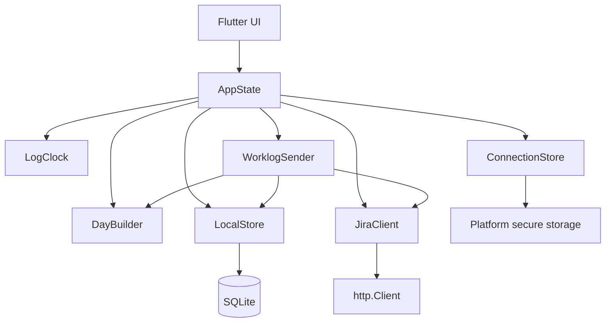

# Jira Time Tracker architecture

## Status and purpose

MVP architecture. Modules are implemented according to the specification: Flutter Desktop shell, Windows interprocess locking (`SingleInstanceLock`), `LocalStore` with SQLite schema v3, Windows Credential Manager FFI, Direct/Scoped authentication in `JiraClient`, pure `LogClock`, `IssueParser`, pure `DayBuilder`, `WorkScreen` and `DayScreen`, add/edit dialogs, existing Jira worklog loading, and reliable submission/reconciliation through `WorklogSender`.

This document owns logic, data, and testing boundaries. User rules, build parameters, Jira protocol, and acceptance criteria belong to the [MVP specification](docs/specs/jira-time-tracker-mvp.md). Implementer rules are in [AGENTS.md](AGENTS.md).

Before implementing UI, read the [screen description and interactive design](docs/design/UX.md). The HTML design guides Flutter widgets; it is not an application module.

## 1. Application shape

One Flutter Desktop process for Windows or macOS, a direct Jira Cloud connection, a local SQLite database, and secure credential storage. Timers recover from stored start timestamps; no background counting process is needed.

Stack: Flutter stable and Dart, Material 3, built-in ChangeNotifier/ListenableBuilder. Dependencies: http for HTTP and fake clients, sqlite3 for persistence, path_provider for data directories, win32 for Windows Credential Manager, flutter_secure_storage_darwin and its platform interface for macOS Keychain, and uuid for persistent identifiers. pubspec.yaml and pubspec.lock define versions.

The [release guide](docs/releases.md) owns build and delivery requirements. The Darwin plugin is separate: Windows receives no additional native backend and requires no C++ ATL for secure storage.

Each module hides meaningful work behind a small interface. Concrete classes and constructor-injected functions suffice for the MVP. No ORM, DI container, server, event bus, or separate use-case layer is needed.

## 2. Modules and dependency direction

Arrows mean calls. main.dart constructs dependencies and passes them to AppState. Every module uses Models; models themselves import no UI, SQLite, HTTP, or platform plugins.

| Path | Status | Module and interface | Hidden implementation |
|---|---|---|---|
| lib/main.dart | Implemented | Startup and dependency composition | Storage opening, exclusion of a second writer, recovery, Flutter UI startup; Flutter Driver requires explicit debug `ENABLE_FLUTTER_DRIVER` |
| lib/single_instance_lock.dart | Implemented | SingleInstanceLock: exclusive file lock | Windows interprocess locking (`RandomAccessFile.lockSync`) |
| lib/models.dart | Implemented | Models, enums, operation results | Typed Issue, QuickIssue, source log, draft, interval, and errors; no network JSON formats |
| lib/local_store.dart | Implemented | LocalStore: local data operations | SQL, migrations, scoped QuickIssue catalog, transactions, log binding/removal from unsubmitted drafts, submission journal, application settings, single writer |
| lib/secure_storage.dart | Implemented | SecureStorage: protected storage | Windows Credential Manager FFI or macOS Keychain; `InMemorySecureStorage` for tests |
| lib/connection_store.dart | Implemented | ConnectionStore: saved/env form loading and connection persistence | Environment defaults, protected credentials, verified authentication route |
| lib/issue_parser.dart | Implemented | IssueParser: key, numeric ID, browse URL parsing | Identifier extraction, URL cleanup, input formats |
| lib/jira_client.dart | Implemented | JiraClient: test connection, read issue/day, create interval, reconcile entry | Direct/scoped authentication, ADF, properties, HTTP responses/errors |
| lib/log_clock.dart | Implemented | LogClock: pure Dart duration from log state and nowUtc | Elapsed time, start/pause transitions, negative clock differences |
| lib/day_builder.dart | Implemented | DayBuilder: buildAsRecorded(input), build(input, seed), validate(plan, existingWorklogs, {requirePauses}) | As-recorded placement, Smart Rebuild allocation, breaks, splitting issues > 1 h, validation |
| lib/worklog_sender.dart | Implemented | WorklogSender: sendDraft, reconcileUnknown, explicit manual unknown resolution | Journal/POST ordering, partial success, interrupted-response recovery, no blind retries |
| lib/app_state.dart | Implemented | AppState: screen coordination and user actions | Module call order, active scope, busy state, theme/language, saved DaySettings, timers, queue |
| lib/app_message.dart | Implemented | AppMessage and MessageException: application-owned messages | IDs, arguments, raw diagnostics without Flutter; old-error compatibility and new-error encoding |
| lib/agent_instructions.dart | Implemented | Standard agent rule, instruction, help in RU/EN | Pure templates with explicit language/URL; MVP section 8.2 owns language behavior |
| lib/l10n/ | Implemented | ARB catalogs and generated AppLocalizations | Russian/English labels, arguments, plural forms; standard `flutter gen-l10n` / `flutter pub get` generation |
| lib/ui/message_format.dart | Implemented | AppMessage and duration presentation | Current BuildContext translation, recursive cause formatting; Jira/user data stays original |
| lib/ui/date_localizations.dart | Implemented | English Material localization with day–month–year dates | Consistent calendar input/numeric dates; MVP section 8.2 owns user rules |
| lib/ui/shell_screen.dart | Implemented | ShellScreen: shell, Work/Day tabs, Settings | Widgets, read-only banner, navigation |
| lib/ui/work_screen.dart | Implemented | WorkScreen: issue catalog, timers, log queue/history | Issue cards, quick-issue menu, live timers, unused queue, bottom build controls |
| lib/ui/day_screen.dart | Implemented | DayScreen: calendar day, schedule, timeline, submission/reconciliation | Schedule table, gaps/conflicts, Jira submission, unknown reconciliation |
| lib/ui/add_time_dialog.dart | Implemented | AddTimeDialog: manual entry (A01) | Separate first quick-issue group, hours/minutes, optional description, fixed start, validation |
| lib/ui/edit_log_dialog.dart | Implemented | EditLogDialog: free stopped-log edits | Hours/minutes, description, fixed start |
| lib/ui/split_log_dialog.dart | Implemented | SplitLogDialog: split a free log | Split offset and separate descriptions |
| lib/ui/merge_logs_dialog.dart | Implemented | MergeLogsDialog: merge free logs | Target issue, combined duration/comments |
| lib/ui/edit_segment_dialog.dart | Implemented | EditSegmentDialog: schedule interval edits | Start/duration changes |
| lib/ui/split_segment_dialog.dart | Implemented | SplitSegmentDialog: split a day interval | Two sequential parts retaining day position |
| lib/ui/merge_segments_dialog.dart | Implemented | MergeSegmentsDialog: merge one source's parts | Combined durations with preserved source reference |
| lib/ui/gap_actions_dialog.dart | Implemented | GapActionsDialog: direct free-time actions | Snap, fill, exact duration with ripple push |
| lib/ui/settings_dialog.dart | Implemented | SettingsPage: application settings | Pinned theme, adaptive Jira/day/quick-issue/API navigation, one content area |
| lib/ui/quick_issue_dialog.dart | Implemented | QuickIssueDialog: validate/configure quick issues | Strict Jira preview without local writes, local-note creation/editing |
| lib/agent_api_server.dart | Implemented | AgentApiServer: embedded AI-agent HTTP API (port 8765) | Reads Jira details/comments/attachments/worklogs via AppState/JiraClient; manages quick catalog, local logs/drafts, never submits to Jira |

Paths guide navigation, not advance creation of empty scaffolds. Create files as needed and split when an independent responsibility emerges. Interface means available operations and their conditions, not a mandatory Dart interface or abstract class.

### Call rules

- Widgets call AppState actions and display results. They own no SQL, Jira requests, allocation algorithms, or retry protocol.
- DayBuilder and LogClock are pure Dart with explicit inputs; they do not independently read clocks, environment, storage, or network.
- Generation, manual editing, and pre-submission checks share DayBuilder.validate. Required validation cannot live only in UI forms.
- LocalStore owns atomicity and association integrity. JiraClient owns HTTP and normalization. Neither calls AppState or widgets.
- WorklogSender alone coordinates worklog creation. UI, recovery, and HTTP-error handlers do not issue independent POSTs.
- AppState persists language via LocalStore; Flutter resolves system language and updates localized widgets. LocalStore identifies a new database before migrations. Language is outside Jira scope and DayDraft snapshots.
- AppState stores the standard agent rule canonically and exposes it for a requested language; custom rules stay original. SettingsPage translates only unchanged standard form text, preserving unsaved edits. The Local Agent API selects standard-rule/help language from application settings, resolving system mode through PlatformDispatcher.
- Domain errors carry AppMessage. Raw string getters retain compatibility for existing Dart clients and the API; UI uses structured messages. Encode new own `last_error` values with a version; keep old strings original. Models/pure modules import no Flutter.

## 3. Data and ownership

Select platform storage at startup: Windows retains WindowsCredentialStorage; macOS uses MacOsKeychainStorage through flutter_secure_storage_darwin without Keychain Sharing. Native entitlements allow outbound Jira requests and inbound local API connections. SingleInstanceLock uses an application-data file; verify conflicts between separate processes, including POSIX platforms.

### Persistent entities

| Entity | Minimum fields | Purpose |
|---|---|---|
| Issue | scope, issueId, key, summary, status?, lastUsedAtUtc, currentLogId? | Issue cache, status, current local-log reference |
| LocalLog | id, scope, issueId, titleSnapshot, description, accumulatedSeconds, runningSinceUtc?, createdAtUtc, consumedAtUtc?, isManual, fixedStartTime? | Original timer/manual record with optional start anchor, independent of build results |
| DayDraft | id, scope, date, startUtc, endUtc, seed, settingsSnapshot, importedWorklogsSnapshot, status | Saved date plan and its inputs |
| DraftLog | draftId, sourceLogId, sourceDurationSeconds, descriptionSnapshot, durationLocked | Unique source/draft binding and full-input snapshot |
| Segment | id, draftId, sourceLogId, issueId, startUtc, durationSeconds, description, sendState, jiraWorklogId?, lastError?, frozenPayload?, isFixed | One source's submitted part, optional fixed anchor, durable delivery state |
| Break | draftId, startUtc, durationSeconds, kind | Generated lunch/short break; other gaps after manual edits derive from the schedule |

Table/class names may be adapted. settingsSnapshot, importedWorklogsSnapshot, and frozenPayload may be JSON in SQLite; nesting alone does not justify separate tables. Do not store per-tick seconds or recomputable screen totals.

scope is the normalized Jira site origin plus verified accountId. Restrict all reads/mutations to the active scope. Switching connections opens the corresponding local set and retains the old one. UI uses one active set. Create JiraClient with immutable connection context so an in-flight submission cannot switch accounts. Disable saving a new connection during submission.

ConnectionStore owns tokens and saved connections. SQLite stores scope/work data, not secrets. Authentication-route cache belongs to the verified connection; edited credentials require revalidation.

### Sources of truth

- SQLite owns saved issues, logs, drafts, and the submission journal. AppState retains the current screen projection and unsaved form fields.
- QuickIssue is a scoped saved reference to a verified Issue, with optional note and insertion order. It does not alter Issue and can be removed independently of issues/logs/history. No quick issues are built in.
- Application-wide DaySettings and agent text rule use separate `app_settings` keys. `DayDraft.settingsSnapshot` stores only numeric settings from its latest successful generation. AppState passes current settings to the builder and updates the snapshot with a successfully saved result. `GET /api/day-settings` returns current settings/rule together. Open-draft application rules belong to [specification section 6.1](docs/specs/jira-time-tracker-mvp.md#61-default-settings).
- LocalLog owns original duration. DraftLog is its unique association to one DayDraft and full build-input snapshot. Segment is a many-to-one LocalLog projection into a day and the source of one Jira worklog. Segment edits do not overwrite LocalLog; parts of different sources cannot merge.
- Jira owns account identity, issue data, and confirmation of worklog creation. Saving sending locally does not prove creation in Jira.
- Breaks belong only to the local schedule and never become Jira worklogs.

### Transactions and constraints

LocalStore exposes complete operations, such as start/pause, whole-draft save, submission-start recording, and confirmed-worklog persistence. Callers do not manage individual SQL rows within these changes.

Transactions cover:

1. Current issue-log/timer state changes, including new-log creation.
2. Draft replacement and bindings/breaks/intervals. Failure retains the previous version.
3. Persisting interval ID, immutable submitted fields, and sending before network access.
4. Persisting sent/worklogId and consuming a source once all remaining parts are confirmed.
5. Removing a source and all its intervals before first submission. After submission starts, reject without partial changes.

Enable foreign_keys and schema versioning. Enforce one unfinished draft per scope/date and one active sourceLogId binding. A DayDraft has at most one DraftLog per LocalLog but may have several Segments for it. Recheck source state during writes: consumed or other-draft sources cannot be reserved again. Agent replacement validates expected revision, every source, and all intervals before one transactional write; partially submitted drafts are immutable. Interval durations are positive; an unstarted log may accumulate zero.

Apply migrations transactionally. Propagate read/migration/write failures rather than replacing a database with an empty one. Single-writer locking must work between Windows processes, not just through an in-memory bool.

## 4. Time and schedules

Persist absolute timestamps in UTC and durations in whole seconds. UI uses the Windows local time zone with the selected date's offset. Stored UTC starts do not change on reopening. Changing the Windows time zone changes displayed local time, not an already-saved submission instant.

LogClock calculates elapsed from accumulatedSeconds, runningSinceUtc, and explicit nowUtc. Flutter ticks redraw only. LocalStore persists Play/Pause results; closing the application is not Pause. Negative elapsed time after a clock change is a problem requiring log review.

DayBuilder receives stopped-log snapshots, locks, date/settings, existing worklogs, and seed. It returns a new plan or explained failure without changing inputs. Specification sections 6–7 own algorithms and numeric settings.

validate uses build's normalized schedule representation and checks constraints regardless of plan origin. Automatic building requires free slots; manual/agent drafts may overlap work while keeping breaks outside work. Use half-open [start, end) intervals so touching boundaries are not overlaps.

On manual boundary/interval edits, update derived gaps and validate saved breaks. Stale Break rows must not create a competing schedule. Compute visible totals from the current validated plan.

## 5. Main flows

### Startup and local work

main.dart obtains the write lock, opens LocalStore/ConnectionStore, restores the active local set, and converts leftover sending to unknown. Saved data does not require Jira login or connectivity. AppState loads restored data and LogClock recalculates running timers.

Manual entry and start/pause go through AppState to complete LocalStore operations. UI displays persisted results after completion. Disk errors leave users able to correct input or retry.

### Building and editing

AppState validates selection, retrieves all accessible day entries through JiraClient, and passes them to DayBuilder. Save successful plans entirely through LocalStore. Loading/generation failures retain the prior draft. Field edits shift later segments and planned breaks without changing their durations, precheck fixed Jira entries, and save the whole plan transactionally. They invoke validate, not build with a fresh seed. Rebuilding passes one source's parts under unique interval identifiers, then restores their source association and original duration. Segment splits retain sourceLogId; merges require identical sourceLogId.

AgentApiServer retrieves dates through a date-scoped AppState operation, loading Jira worklogs for the request without changing the UI date. Issue history uses paginated `JiraClient.getIssueWorklogs` without changing the open day. JiraClient owns issue/comments reading and attachment ownership checks/streaming; AppState supplies active credentials. Accept only loopback Host and own Origin. Agents replace whole drafts with the revision read. AppState validates revision, draft state, sources, and timeline before LocalStore saves one transaction. The API neither creates LocalLogs implicitly from Segments nor exposes Jira submission.

### Submission

After Day-screen validation, AppState passes draftId and the verified connection to WorklogSender. Sender validates scope, then persists sending, POSTs one interval, and saves its result. Finish SQL transactions before network waits; networking does not hold database locks.

JiraClient explicitly classifies confirmed creation, confirmed rejection, and unknown outcomes. Sender applies/persists durable transitions. Specification section 10.3 owns the property, matching, and manual-resolution protocol; do not add another retry mechanism here.

Only Sender decides whether an interval can retry. Segment IDs survive restarts and allowed retries. Refreshing a day counts confirmed worklogs by jiraWorklogId rather than adding external time over their own intervals.

## 6. Testing interfaces

Substitute dependencies where they vary, testing through the same interfaces used by the application.

| Tested behavior | Real dependency | Test substitute |
|---|---|---|
| Timer | Explicit current UTC instant | Fixed timestamps without waiting an hour |
| Building/validation | Pure function with inputs/seed | Logs, occupied intervals, fixed seeds |
| LocalStore | SQLite file in application directory | Temporary database, reopening, same-code transaction checks |
| JiraClient | http.Client | MockClient with pagination, rejections, interrupted responses, properties |
| ConnectionStore | Environment and Windows secure storage | Explicit environment map and fake secret read/write operations |
| WorklogSender | JiraClient and LocalStore | Real temporary database and fake HTTP transport |
| UI | AppState and modules | Same modules with temporary data and fake external dependencies |
| Local Agent API | AgentApiServer, AppState, JiraClient, LocalStore | Real HTTP server, temporary database, fake Jira transport for two dates, revision conflicts, atomic rejection |

No universal mock framework is needed for each external resource. Use flutter_test and the chosen HTTP package. Do not fake WorklogSender itself when checking delivery; interrupted responses and recovery must pass through its journal.

Scenarios A01–A24 and completion commands remain in specification sections 12–13. Keep the module map here as code evolves; exact application startup commands belong in README.
